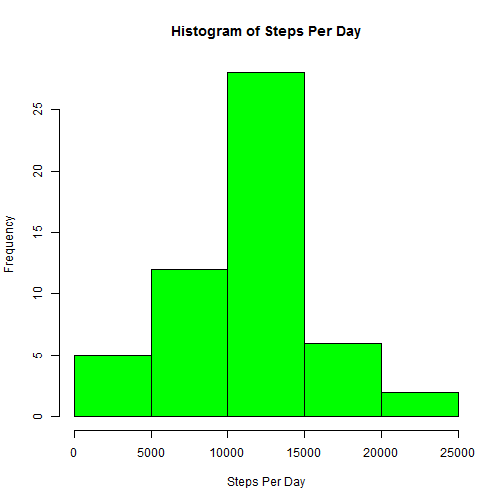
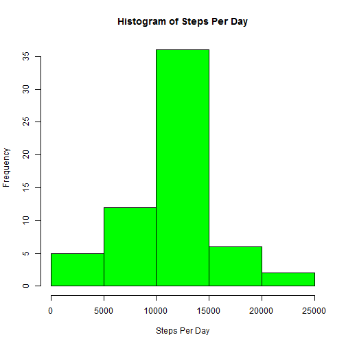
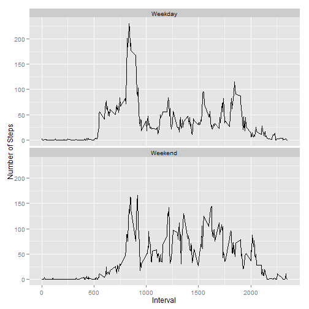

Data Analysis
================================

#Assignment 1


Download File

```r
fileUrl <- "http://d396qusza40orc.cloudfront.net/repdata%2Fdata%2Factivity.zip"
download.file(fileUrl,destfile="./data.zip")
unzip("data.zip")
activity <- read.csv("activity.csv")
```

Transform Date

```r
activity$date <- as.Date(activity$date)
```

Histogram of Steps Per Day

```r
hist(tapply(activity$steps, activity$date, sum), col = "green", 
     main = "Histogram of Steps Per Day", xlab = "Steps Per Day")
```

 

Mean and Median of Steps Per Day

```r
mean(tapply(activity$steps, activity$date, sum), na.rm=TRUE)
```

```
## [1] 10766
```

```r
median(tapply(activity$steps, activity$date, sum), na.rm=TRUE)
```

```
## [1] 10765
```

Average Daily Activity Pattern, 
Time Series Plot of Daily Activity Pattern

```r
library(ggplot2)
ggplot(aes(x = interval, y = steps), data = activity) + geom_line(stat = 'summary', fun.y = mean, na.rm = TRUE)
```

 

Intervals sorted from highest average value to lowest average value, the 835th interval
has the highest value

```r
maxinterval <- tapply(activity$steps, activity$interval, mean, na.rm = TRUE)
sort(maxinterval, decreasing = TRUE)
```

```
##       835       840       850       845       830       820       855 
## 206.16981 195.92453 183.39623 179.56604 177.30189 171.15094 167.01887 
##       815       825       900       810       905       910       915 
## 157.52830 155.39623 143.45283 129.43396 124.03774 109.11321 108.11321 
##       920      1550      1845      1545       925      1210      1215 
## 103.71698 102.11321  99.45283  98.66038  95.96226  94.84906  92.77358 
##      1205      1850      1855      1840      1815      1900      1555 
##  87.69811  86.58491  85.60377  85.33962  85.32075  84.86792  83.96226 
##      1540      1725      1905      1830      1740      1810      1610 
##  82.90566  78.94340  77.83019  77.69811  75.09434  74.69811  74.54717 
##      1835       800      1720       745      1730       805      1825 
##  74.24528  73.37736  72.71698  69.54717  68.94340  68.20755  67.77358 
##      1255       930      1535      1605      1200       615      1220 
##  67.28302  66.20755  65.32075  64.13208  63.86792  63.45283  63.39623 
##      1615      1600      1715      1355      1625      1735      1820 
##  63.16981  62.13208  61.22642  60.81132  59.77358  59.66038  59.26415 
##      1155      1910      1805       750      1620      1745      1325 
##  59.18868  58.03774  58.01887  57.84906  56.90566  56.50943  56.43396 
##      1705       755      1400       730       715      1230       610 
##  56.30189  56.15094  55.75472  55.67925  54.50943  54.47170  53.77358 
##      1345      1915      1015       740       630      1405       725 
##  53.54717  53.35849  52.66038  52.26415  52.15094  51.96226  50.98113 
##      1025      1710       710      1225      1135       620       720 
##  50.79245  50.71698  50.50943  50.16981  49.98113  49.96226  49.92453 
##       605       655      1415      1530      1525      1350       625 
##  49.26415  49.03774  48.69811  48.13208  47.75472  47.32075  47.07547 
##      1700      1320      1650      1150      1520      1950      1645 
##  46.62264  46.24528  46.20755  46.03774  45.96226  45.66038  45.45283 
##       935      1250      1640      1145       555       705       735 
##  45.22642  45.05660  44.66038  44.60377  44.49057  44.37736  44.32075 
##      1030       645       640      1630       700      1455      1655 
##  44.28302  44.16981  44.01887  43.86792  43.81132  43.77358  43.67925 
##      1450      1410      1310      1330      1010      1300      1140 
##  43.62264  43.58491  43.26415  42.75472  42.41509  42.33962  42.03774 
##      1430      1315      1800      1000      1935      1340      1305 
##  41.84906  40.98113  40.67925  40.56604  40.01887  39.96226  39.88679 
##       550       635      1020      1515       945      1635      1245 
##  39.45283  39.33962  38.92453  38.84906  38.75472  38.56604  37.73585 
##      1425      1755      1035       650      1920      1505      1510 
##  37.54717  37.45283  37.41509  37.35849  36.32075  36.07547  35.49057 
##      1420       950      1750      1040      1955      1130      2015 
##  35.47170  34.98113  34.77358  34.69811  33.52830  33.43396  33.33962 
##      1235      2050      1055       600      1100      1940      1500 
##  32.41509  32.30189  31.94340  31.49057  31.35849  30.20755  30.01887 
##      1105      1120      1045      1435      1930      2030      1005 
##  29.67925  28.37736  28.33962  27.50943  27.39623  27.30189  26.98113 
##      2020      1240      1125      1445      1115      1945      1335 
##  26.81132  26.52830  26.47170  26.07547  25.54717  25.54717  25.13208 
##      1050       940      2110      2035      1110      2045      2025 
##  25.09434  24.79245  23.45283  21.33962  21.32075  21.32075  21.16981 
##       955      1925      2055      2000      2040      2010      2115 
##  21.05660  20.71698  20.15094  19.62264  19.54717  19.33962  19.24528 
##      2005       545      2105      1440      2135       540      2100 
##  19.01887  18.33962  17.22642  17.11321  16.30189  16.01887  15.94340 
##      2130      2120      2230      2225      2140      2215      2150 
##  14.66038  12.45283   9.75472   8.69811   8.67925   8.50943   8.13208 
##      2125      2145      2220       535      2210      2335      2255 
##   8.01887   7.79245   7.07547   6.05660   4.81132   4.69811   4.60377 
##       430      2205       440       520      2300      2340       450 
##   4.11321   3.67925   3.49057   3.32075   3.30189   3.30189   3.11321 
##       510       525      2305      2155      2330       410       515 
##   3.00000   2.96226   2.84906   2.62264   2.60377   2.56604   2.24528 
##      2235        25       530       130         0       330      2250 
##   2.20755   2.09434   2.09434   1.83019   1.71698   1.62264   1.60377 
##      2325       505       250        45      2200       400       210 
##   1.58491   1.56604   1.54717   1.47170   1.45283   1.18868   1.13208 
##       125       455      2355      2320       255       405        35 
##   1.11321   1.11321   1.07547   0.96226   0.94340   0.94340   0.86792 
##       445      2315       105       435      2345       325       335 
##   0.83019   0.83019   0.67925   0.66038   0.64151   0.62264   0.58491 
##        30       340       145       425         5       115       420 
##   0.52830   0.49057   0.37736   0.35849   0.33962   0.33962   0.33962 
##       100      2240        50       150       235      2350       320 
##   0.32075   0.32075   0.30189   0.26415   0.22642   0.22642   0.20755 
##       135       140        15       110        10        55       225 
##   0.16981   0.16981   0.15094   0.15094   0.13208   0.13208   0.13208 
##      2245        20       345        40       120       155       200 
##   0.11321   0.07547   0.07547   0.00000   0.00000   0.00000   0.00000 
##       205       215       220       230       240       245       300 
##   0.00000   0.00000   0.00000   0.00000   0.00000   0.00000   0.00000 
##       305       310       315       350       355       415       500 
##   0.00000   0.00000   0.00000   0.00000   0.00000   0.00000   0.00000 
##      2310 
##   0.00000
```

Calculate the # of missing values in the data set

```r
sum(is.na(activity$steps))
```

```
## [1] 2304
```

Fill in missing values using the mean of the interval

```r
library(plyr)
library(Hmisc)
activity2 <- ddply(activity, "interval", mutate, imputed.value = impute(steps, mean))
activity2 <- activity2[order(activity2$date, activity2$interval),]
#imputed value converted to a numeric value
activity2$imputed.value <- as.numeric(activity2$imputed.value)
```

Histogram of Steps Per Day With Imputed Data

```r
hist(tapply(activity2$imputed.value, activity2$date, sum), col = "green", 
     main = "Histogram of Steps Per Day", xlab = "Steps Per Day")
```

 

Mean and Median of Steps Per Day, the values are very similar to the original values
This does not change the prediction of the number of steps taken per day

```r
mean(tapply(activity2$imputed.value, activity$date, sum), na.rm=TRUE)
```

```
## [1] 10766
```

```r
median(tapply(activity2$imputed.value, activity$date, sum), na.rm=TRUE)
```

```
## [1] 10766
```

Differences in activity patterns between weekdays and weekends, Create a variable for weekend and weekdays

```r
##Convert the date to weekdays
activity2$wkday <- weekdays(activity2$date)
##Create weekend vector
weekend <- c("Saturday", "Sunday")
##create logical variable to determine if a day is a weekday or weekend
activity2$IsWeekend <- activity2$wkday %in% weekend
##change the logical variable to a factor variable
activity2$IsWeekend <- as.factor(activity2$IsWeekend)
##change the labels to weekday and weekend
levels(activity2$IsWeekend) <- c("Weekday", "Weekend")
```


```r
ggplot(aes(x = interval, y = imputed.value), data = activity2) + 
  geom_line(stat = 'summary', fun.y = mean, na.rm = TRUE) +
  ylab("Number of Steps") + xlab ("Interval")+
  facet_wrap(~IsWeekend, nrow = 2)
```

 

